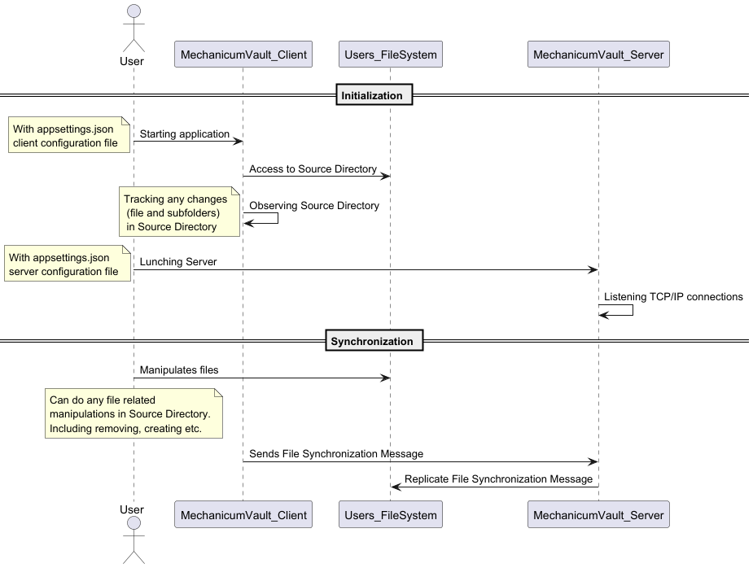
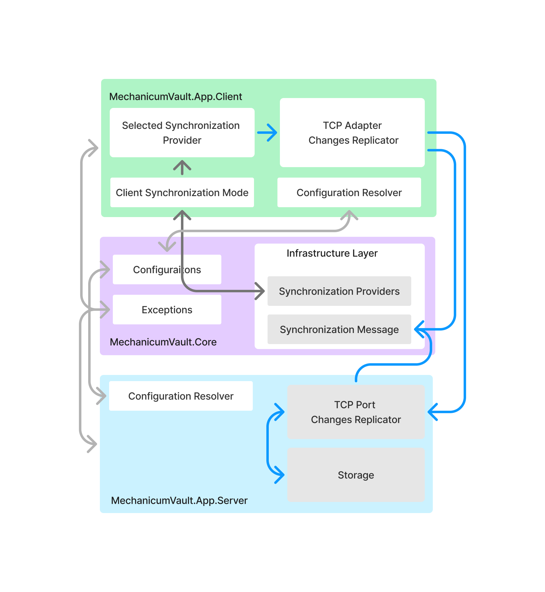

# Mechanicum Vault

An application that allows synchronization of files and folders from one desired source to another over TCP/IP.

## Table of Contents

- [Overview](#overview)
- [Features](#features)
- [Usage](#usage)
- [Future Plans](#future-plans)
- [Architecture](#Architecture)
- [License](#License)

## Overview

This application enables you to synchronize files and folders from a specified source to a target destination over TCP/IP.
When the client is running, it tracks file changes in real-time. 
Once a connection to the server is established, the client will request 
synchronization to ensure both the source and destination are up-to-date.

## Features

- **Real-time Change Tracking**: The client monitors file changes continuously and sends synchronizations to server.
- **TCP/IP Synchronization**: Transfers files over TCP/IP protocol (Unscripted currently).
- **Automatic Sync Requests**: Initiates synchronization until server will be online.

## Usage

! Applications are developed on Windows platform, and it was not tested on Unix based platforms.
! Both applications have configuration files that you need to tweak, or you could call application with command line arguments

````shell
# Executed Client-Side Application
dotnet run --project src/MechanicumVault.App.Client/MechanicumVault.App.Client.csproj
````
Configuration: ``src/MechanicumVault.App.Client/appsettings.json``
`````shell
# Example with command line argument
dotnet run --project src/MechanicumVault.App.Client/MechanicumVault.App.Client.csproj --Application:SourceDirectory="D:\TempSpace\Source"
`````

````shell
# Executed Server-Side Application
dotnet run --project src/MechanicumVault.App.Server/MechanicumVault.App.Server.csproj
````
Configuration: ``src/MechanicumVault.App.Server/appsettings.json``
`````shell
# Example with command line argument
dotnet run --project src/MechanicumVault.App.Server/MechanicumVault.App.Server.csproj --Application:DestinationDirectory="D:\TempSpace\Destination"
`````

## Future Plans

- **Release automation**: Add automated testing, linting and build releases.
- **Encryption Support**: Implement encrypted file transfers for enhanced security.
- **Enhancements**: Introduce additional synchronization providers, Google Drive via API HTTP.
- **Audit log**: Create Client based audit log with file changes per client.
- **File versioning**: Track file versions.
- **User Authentication**: Introduce authentication mechanisms to secure access and improve encryption.

## Architecture

### Processing workflow



### Abstract Design 



## License

[LICENSE](LICENSE.md)
